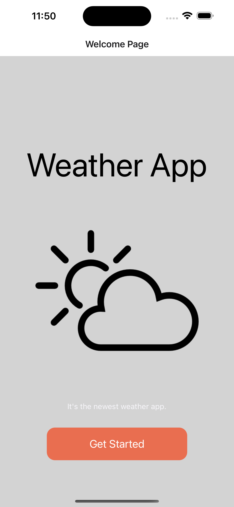
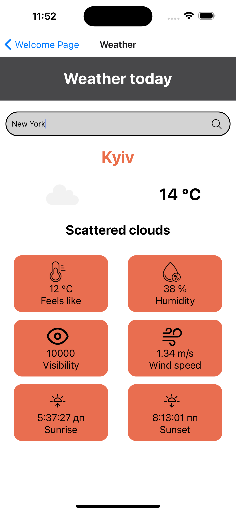

# Weather app

A simple weather app with the ability to search for a city by name.

[Project page](https://expo.dev/@nadiiakoch/weather-app?serviceType=classic&distribution=expo-go)

## Technology

## Screenshot

## 

## 

## Running the project

Open the camera app on your device and scan the code below

